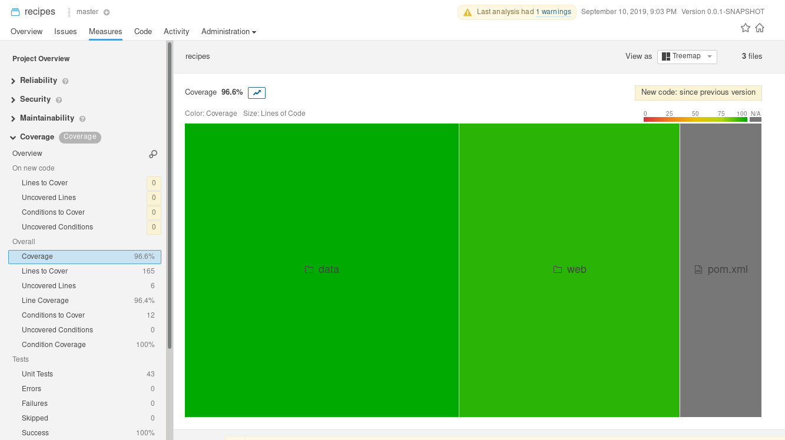

# Spring Recipe App
Multimodule spring recipe app. Provides restful api with various unit tests that covers almost all the project.

# Code
## Multimodule
The project is composed of 2 modules:
- `data`: handles data presentation, repositories and services
- `web`: contains the web application, the bootstrap code and the controllers

``` xml
	<modules>
		<module>web</module>
		<module>data</module>
	</modules>
```

## Service Implementation
Inside `data` module, there are 2 provided implemetations depending on the active profile:
- map: based on simple map implementation
- spring data jpa: depending on spring data jpa repositories

The map implementation is provided by default
``` java
@Service
@Profile({"default", "map"})
public class PotatoMapService implements PotatoService {
}
```

The active profile can be changed by adding the following line to `application.properties`:
`spring.profiles.active=springdatajpa`


## RESTful Controller
[http://localhost:8080/api](http://localhost:8080/api)


## Unit tests
43 unit tests with more than 80%.
Tests where made using `junit5` and `mockito` project
``` xml
<dependency>
    <groupId>org.junit.jupiter</groupId>
    <artifactId>junit-jupiter-api</artifactId>
    <scope>test</scope>
</dependency>
<dependency>
    <groupId>org.junit.jupiter</groupId>
    <artifactId>junit-jupiter-engine</artifactId>
    <scope>test</scope>
</dependency>

<dependency>
    <groupId>org.mockito</groupId>
    <artifactId>mockito-junit-jupiter</artifactId>
    <version>3.0.0</version>
    <scope>test</scope>
</dependency>
<dependency>
    <groupId>org.mockito</groupId>
    <artifactId>mockito-core</artifactId>
    <version>3.0.0</version>
    <scope>test</scope>
</dependency>
```


# Tools
## Database
The database used in action is the default in memory data base `h2`.  
h2 link: [http://localhost:8080/h2-console](http://localhost:8080/h2-console)  


## Code quality
I used `sonarqube` For code analysis using sonarqube .
`podman run --rm --name sonarqube -p 9000:9000 sonarqube`

### Plugin
``` xml
<plugin>
		<groupId>org.sonarsource.scanner.maven</groupId>
		<artifactId>sonar-maven-plugin</artifactId>
		<version>3.6.0</version>
</plugin>
```
### Properties
``` xml
<properties>
	<sonar.host.url>http://localhost:9000</sonar.host.url>
	<sonar.projectName>recipes</sonar.projectName>
	<sonar.login>admin</sonar.login>
	<sonar.password>admin</sonar.password>
	<sonar.core.codeCoveragePlugin>jacoco</sonar.core.codeCoveragePlugin>
	<sonar.jacoco.reportPath>${project.basedir}/../target/jacoco.exec</sonar.jacoco.reportPath>
    <sonar.language>java</sonar.language>
    ...
<properties>
```


### Code coverage
For test coverage, I used `jacoco` plugin in integration `sonarqube`.
``` xml
<plugin>
		<groupId>org.jacoco</groupId>
		<artifactId>jacoco-maven-plugin</artifactId>
        <version>0.8.4</version>
        ...
</plugin>
```



# TODO
- [ ] Add persistance database
- [ ] Add swagger-ui
- [ ] Add more models and ingredients
- [ ] Add [circle-ci](https://circleci.com/) integration
- [ ] Add [codecov.io](https://codecov.io) integration